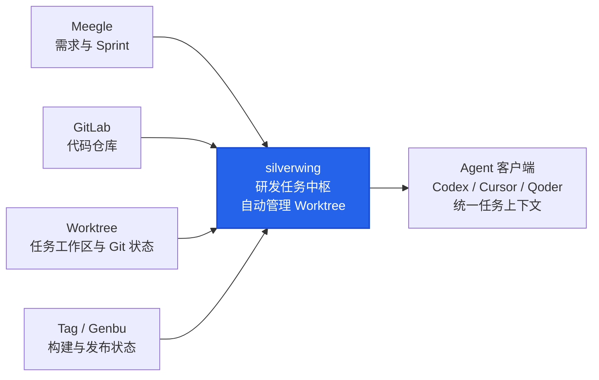

# silverwing

> 面向多仓库和 Agent 协作的任务级研发工作台，让每个需求拥有自己的代码现场。

silverwing 是一款本地优先的任务级研发工作台。它帮助你把一个跨多个代码仓库的需求，整理成一个独立、清晰、可追溯的任务工作区。任务关联的服务、分支、说明、工作区状态和交付记录集中在一起，让多仓库协作和 Agent 协作都有明确的上下文。

silverwing 是一个以研发任务为核心的一体化本地研发工作台：它把 Meegle 需求、GitLab 代码仓库、Git Worktree 隔离工作区、Agent 工作区、测试 Tag 以及 Genbu 构建与发布状态串联在一起，形成从需求到交付的完整任务上下文。

## silverwing 如何串联各环节

silverwing 将需求、代码、工作区和交付状态汇总成统一任务上下文，再提供给 Codex、Cursor、Qoder 等 Agent 客户端。

## 适合什么场景

- 一个需求需要同时调整前端、后端、网关或其他多个服务；
- 同时推进多个需求，希望每个需求拥有独立的目录和分支；
- 希望从一个任务入口管理需求说明、工作区状态和交付动作；
- 团队需要按业务线维护服务清单、协作规则和交付配置。

## 快速开始

下面是一条以 Meegle 需求为入口的标准研发流程。开始前请完成 Meegle 接入；本文不展开手工创建任务的替代方式。

### 首次配置（一次）

1. **接入 Meegle**：在设置中确认 Meegle CLI 可用，按登录提示完成登录并选择对应项目空间。确认本期 Sprint 的目标需求中，当前登录账号被填入“服务端工程师”或团队使用的其他人员角色；这决定了需求能否出现在你的候选列表中。
2. **添加本地 Git 仓库**：在“服务与仓库”中添加本机已有的 Git 主仓库。请选择正常开发用的主仓库，不要选择临时 Linked Worktree、Bare 仓库或重复目录。
3. **配置服务和模块**：将仓库归入业务组，配置服务、模块、基线分支和工作区策略。多需求并行开发时，优先选择“标准 Worktree”；它会为每个任务创建隔离工作区，不切换原主仓库。
4. **确认 Codex 可用**：在设置中确认 silverwing 已识别 Codex；若自动识别失败，请手动配置 Codex 路径后再继续。

### 日常研发（每个需求）

1. **选择本期需求**：进入“研发任务”的需求列表，选择当前 Sprint 和对应需求。打开需求详情后，点击“基于该需求创建研发任务”。
2. **创建研发任务**：核对自动带入的需求链接、标题和分支，填写任务目录名称和任务说明，并选择这次需要修改的服务或模块。
3. **确认工作区已创建**：创建完成后，任务详情会展示每个模块的独立工作区、分支和 Git 状态。标准 Worktree 不会移动或切换原主仓库；任务目录中也会生成供 Agent 使用的任务上下文。
4. **打开 Codex 并行开发**：从任务或具体工作区打开对应 Codex。不同需求、服务或模块应使用各自隔离的任务工作区和 Codex 会话；silverwing 提供隔离与入口，不会自动替你运行多个会话。
5. **完成交付并归档**：开发后先检查未提交文件、未推送提交和分支风险，完成提交与推送。服务和模块已开启 Tag 时，可按需构建测试 Tag 并查看 Genbu 状态；任务完成后归档，保留代码现场、任务上下文和交付记录。

> Tag 和 Genbu 属于可选交付步骤，取决于服务和模块配置。端口、数据库、Docker、凭据和外部测试环境仍由具体项目和使用者管理。

### 常见卡点

- **需求未出现**：检查 Meegle 登录状态、项目空间、当前 Sprint，以及当前账号是否被填写在需求对应的人员角色中。
- **仓库无法添加**：确认选择的是有效的本地 Git 主仓库，而不是 Bare 仓库、临时 Worktree 或重复目录。
- **Codex 无法打开**：检查设置中的 Codex 路径，以及本机 Codex CLI 是否可用。

## 功能介绍

### 按任务创建独立工作区

- 一个任务可以同时选择多个服务和模块，统一查看和管理；
- 支持标准 Worktree 和独立克隆两种工作区方式，适应不同的分支协作模式；
- 多个任务可以同时存在，每个任务都有自己的目录和工作区，彼此隔离；
- 恢复或修复工作区前会检查仓库身份、分支和工作区状态，异常目录会先保留为备份。

### 按业务组管理服务

- 按团队或业务线组织仓库和服务，支持服务排序和分组展示；
- 为服务配置显示名称、主分支及工作区模块；任务创建的分支名前缀和默认打开工具使用全局设置；
- 同一个仓库可以被多个业务组复用，创建任务时只选择本次需要的服务；
- 可按服务或模块单独启用测试 Tag，并配置相应的交付规则。

### 让需求上下文跟着任务走

- 创建任务时可关联需求编号或飞书项目（Meegle）需求链接；
- 连接 Meegle 后，可查询当前账号可用的需求，获取需求标题并识别所属 Sprint；
- 支持配置需求资料目录，按 Sprint 组织资料，并在已有资料目录时复用；
- 支持维护全局、业务组和任务三级 Agent 说明，自动汇总为任务级 `AGENTS.md`；
- 任务人工说明始终保留，外部编辑说明文件后可同步变化并提示冲突。

### 从任务直接打开常用工具

在任务或具体工作区中，可以直接打开编辑器、终端、文件夹和 Agent 工具，包括 IntelliJ IDEA、WebStorm、PyCharm、Visual Studio Code、Android Studio、DevEco Studio、Codex 和 Cursor。常用工具路径可以自动识别，也可以手动配置。

### 支持 Agent 协作

- 为 Codex 等 Agent 提供任务级入口，可查看任务配置、生成任务方案、创建任务、查询工作区状态和追踪测试 Tag；
- 创建任务前先展示完整方案，确认后才执行创建，便于人工检查需求、分支和服务范围；
- Agent 操作限定在 silverwing 提供的任务能力内，不提供任意 Shell 或 Git 操作入口。

### 集中查看任务和 Git 状态

- 任务列表区分进行中和已归档任务，支持按名称搜索；
- 任务详情集中展示需求、分支、工作区路径、任务说明和服务状态；
- 直接查看未提交文件、未跟踪文件、未推送提交，以及工作区缺失、分支不一致、Detached HEAD 和进行中的 Git 操作；
- 对可修复的异常提供预计动作和恢复入口，方便在处理前确认影响范围。

### 构建和追踪测试 Tag

- 支持从单个工作区构建测试 Tag，也支持批量处理一个任务中的多个服务；
- 构建前执行工作区风险检查和合并预检，构建结果、目标分支和历史记录集中保存；
- 可筛选 Tag 构建记录，复制测试 Tag 发版信息；
- 可在 Tag 设置中统一开关 Tag 功能，并设置最多保留的 Tag 组数量，超出后自动清理最旧历史组；
- 对冲突、中断、失败和部分完成的操作提供继续或重试入口；
- 启用 Genbu 后，可追踪 Tag 的构建、UAT 发布和生产发布状态；Genbu 构建失败时可按下一版本重新打 Tag。

### 安全的任务生命周期管理

- 归档后任务、工作区和代码仍然保留，可随时恢复；
- 归档和删除前检查未提交内容、未推送提交和进行中的 Git 操作；
- 涉及 Git 写入的操作会显示检查结果和预计动作；
- 不自动 Force Push、Rebase 或替你解决冲突，冲突处理和最终交付决定由用户掌握。

### 本地优先的使用体验

silverwing 负责管理本地任务目录、代码工作区和 Git 状态。查看状态时不会为了刷新信息偷偷 Fetch；端口、数据库、Docker、凭据和外部测试环境仍由各自的项目和使用者管理。

## 使用边界

silverwing 管理的是任务级代码工作区和 Git 协作状态，不代替具体项目的业务运行环境。服务启动、端口分配、数据库、Docker、凭据以及外部测试环境，仍由对应项目自行负责。

详细操作说明见[日常使用指南](docs/USER-GUIDE.md)。
